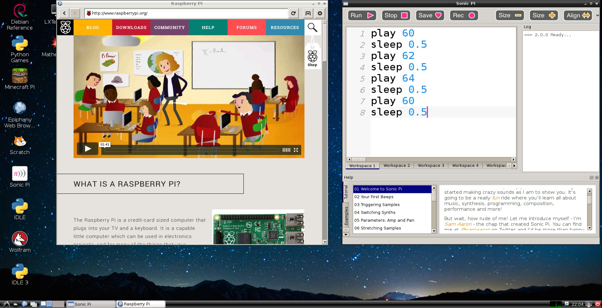
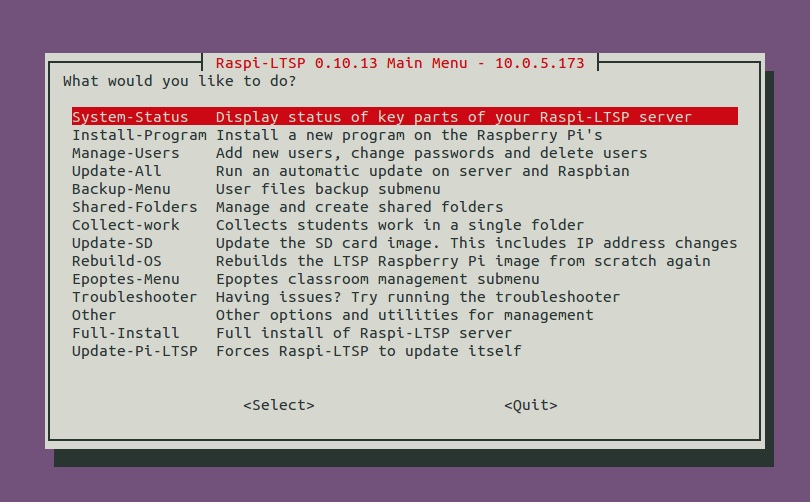

[Home](README.md)    | [Getting started](installation/getting-started.md)     | [Managing users](manage-users/README.md) | [Collecting work](collect-work.md) | [Shared folders](shared-folders/README.md) | [Backups](backups/README.md) | [Advanced options](advanced/README.md) 
| :-----------: |:-------------:| :-----:| :-----:| :-----:| :-----:| :-----:| 

Raspberry Pi LTSP Documentation
===============================

#What is Raspi-LTSP?
Raspi-LTSP is a utility for setting up infrastructure required for a classroom set of Raspberry Pis.
Its main features include
- **Network based user accounts** - A student can log onto any Raspberry Pi in the classroom and have access to their files. Their files are stored centrally on the server.
- **Centralised master operating system** - All the Raspberry Pis boot a single master operating system from the server every boot.
- **Automated work submission and collection system** - A teacher can easily collect work from students digitally for marking without the need for printing.

Raspi-LTSP requires a wired Ethernet connection between the server machine and every Raspberry Pi. Infrastructure for this is usually already included in ICT classrooms but if not, a simple network is relatively cheap and simple to set up.
On top of this, an old desktop or laptop is required to run the server. It does not need to be powerful as will be running Ubuntu Linux, a very lightweight operating system.  

**Wifi is not supported** due to it being unreliable and slow

###Advantages compared to a usual Raspberry Pi classroom setup
- No more flashing 100s of SD cards, just drop on 30mb (compared to 3gb for Raspbian).
- Students can log into any Raspberry Pi in the classroom.
- Backup utility included to automatically backup all students work regularly.
- No more assigning pupils to a single SD card.
- No more needing to purchase 100s of SD cards for a single school, just need enough for 1 class set.
- System is incredibly simple to setup with full userguide, one trial school even got a year 7 student to set it up on his own, he had no issues.
- Due to all the Raspberry Pis booting off the server, if you want to add a new piece of software to every Raspberry Pi in the classroom, update master image and reboot all Raspberry Pis, that is it...
 
 

#To get started [click here](installation/getting-started.md)
   
    
   
#Main documentation list

##[Getting started](installation/getting-started.md)    
  - [Installing Ubuntu](installation/installing-ubuntu.md)  
  - [Installing RaspberryPi LTSP](installation/installing-raspi-ltsp.md)
  - [Copy boot files to SD card](installation/sd-card-copy.md)

##[Managing users](manage-users/README.md)   
  - [Creating a new user](manage-users/creating-users.md)
  - [Deleting a user](manage-users/deleting-users.md)  
  - [Changing a users password](manage-users/change-password.md)  
  - [Userstanding staff and sudo options](manage-users/staff-sudo.md)  

##[General features](general-features.md)

- [Installing additional software](installation/installing-software.md)  
- [Configuring automatic backups](backups/README.md)
- [Collecting students work](collect-work.md)  
- [Updating SD card image](sd-card-update.md) 
- [Shared folders](shared-folders/README.md)
- Epoptes classroom management software (Documentation not complete yet)

##[Advanced options](advanced/README.md)
  - [Editing Raspbian outside of Raspi-LTSP](advanced/editing-outside.md)  
  - [Boot files explanation](advanced/boot-files.md)  
  - [Understanding network technologies](advanced/network-technologies)

##Other

- Troubleshooting (Documentation not complete yet)
- [Frequently asked questions](faq.md)

#Contributing
All the documentation written in markdown can be found in the [Github repository](https://github.com/RaspberryPi-LTSP/RaspberryPi-LTSP-Documentation).   
If you see **issues/typos/mistakes/etc** in this documentation please feel free to send in [pull requests](https://github.com/RaspberryPi-LTSP/RaspberryPi-LTSP-Documentation/pulls) to fix them or open an [issue](https://github.com/RaspberryPi-LTSP/RaspberryPi-LTSP-Documentation/issues).  
If you want to **contribute** to the documentation (**please do!!**) then check out the [contributing guide](CONTRIBUTING.md)

#Support
Having issues with Raspi-LTSP, have a general question or just want some help setting up Raspi-LTSP in your school?   
[Check out the support page on details of how to get in touch.](support.md)
   