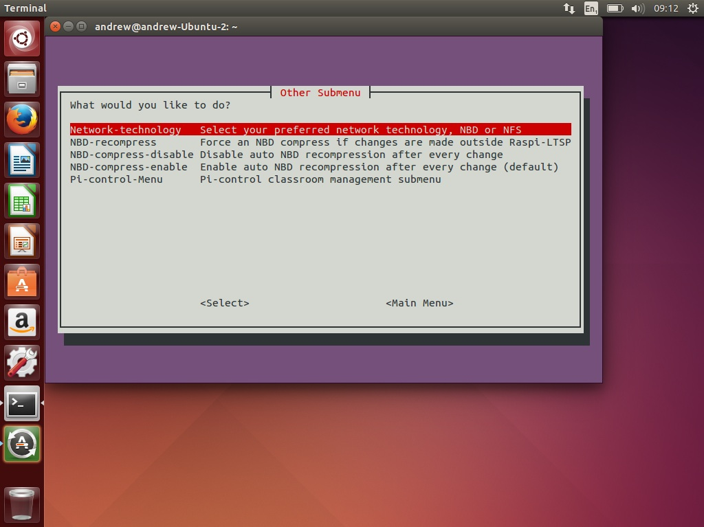

Advanced options
-----------------------------

  

RaspberryPi LTSP has a number of optioned for advanced users who want to fiddle with the configuration of the system.
These options are not aimed at beginners.   
In this section you will find information on how some of the backend features 
are Raspberry Pi LTSP work plus how to configure some of them.   

Information
------
- [What do the boot files on the SD card do?](boot-files.md)
- [Editing Raspbian outside of Raspi-LTSP utility](editing-outside.md)
- [RaspberryPi-LTSP Benchmarks](benchmarks.md)

Advanced options
-----
- [Network Technologies (NFS and NBD)](network-technologies.md)
- [Changing the default desktop and login screen background](change-background.md)