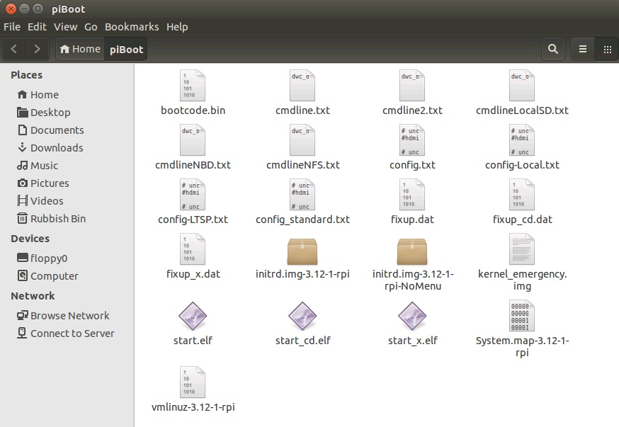

[Home](../README.md)    | [Getting started](../installation/getting-started.md)     | [Managing users](../manage-users/README.md) | [Collecting work](../collect-work.md) | [Shared folders](../shared-folders/README.md) | [Backups](../backups/README.md) | [Advanced options](../advanced/README.md) 
| :-----------: |:-------------:| :-----:| :-----:| :-----:| :-----:| :-----:| 

Understanding the boot folder files
-----------------------------------

The autogenerated boot folder (stored in /home/YourUser/piboot) is made
up of a number of configuration files and boot files.

-   **System.map-KERNEL** – A debug file for kernel panics.

-   **Bootcode.bin** – Untouched Raspberry pi bootloader.

-   **Cmdline.txt** – Default kernel config file, contains NBD server IP
    address, by default this is 1.1.1.1.

-   **Cmdline2.txt** – cmdline.txt’s twin, only here for maintaining legacy
    setups

-   **CmdlineLocalSD** – The cmdline.txt file with the kernel settings for a
    standard Raspbian OS.

-   **CmdlineNBD.txt** – The cmdline.txt file with the kernel settings for
    Raspi-LTSP NBD booting.

-   **CmdlineNFS.txt** – The cmdline.txt file with the kernel settings for
    Raspi-LTSP NFS booting (legacy).

-   **Config-LTSP** – The main Raspberry Pi config.txt file for Raspi-LTSP.

-   **ConfigLocal.txt** – The main Raspberry Pi config.txt for local
    Raspbian booting.

-   **Config.txt** – The current in use config.txt file, by default boots
    Raspi-LTSP.

-   **Config\_standard** – The main raspberry Pi config.txt for Raspi-LTSP
    with overclocking disabled.

-   **Fixup.dat, fixup\_cd.dat, fixup\_x.dat** – Untouched Raspbian boot
    files

-   **Initrd.img-KERNEL** – The initrd used by Raspi-LTSP. An initrd is a
    mini Linux operating system used to kickstart the main operating
    system. It contains the bootmenu script.

-   **Initrd.img-KERNEL-NoMenu** – The old initrd used by Raspi-LTSP. It
    does not contain the bootmenu script.

-   **Kernel\_emergency.img** – An untouched Raspbian recovery kernel.

-   **Start.elf, start\_cd.elf, start\_x.elf** – Untouched Raspbian boot
    files.

-   **Vmlinuz-KERNEL** – The main Raspi-LTSP kernel.

###Additional files you may have

-   **Kernel.img** – An untouched Raspbian kernel.

-   **Initrd.img** – An untouched Raspbian Initrd (very rarely used)
