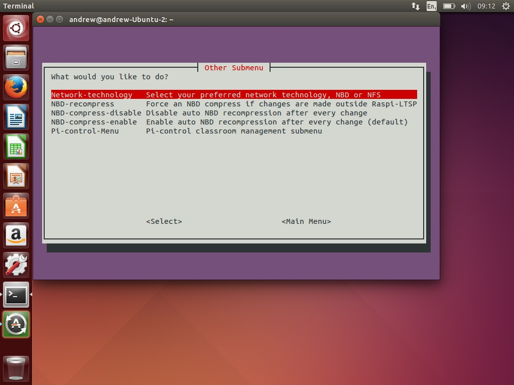
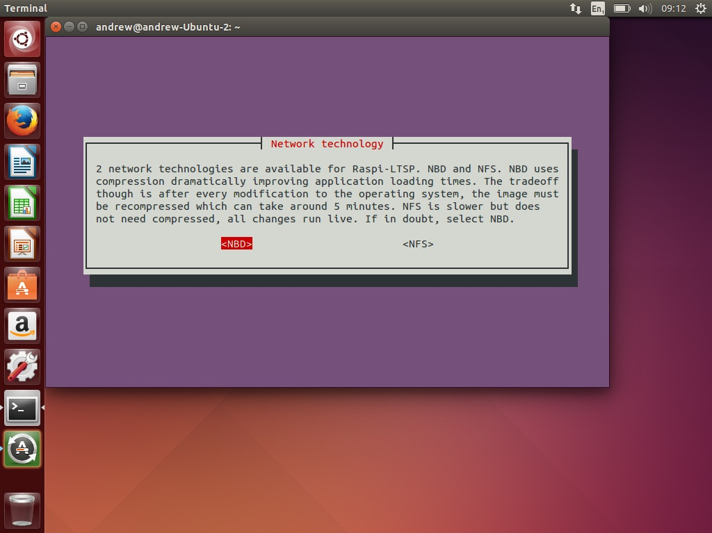
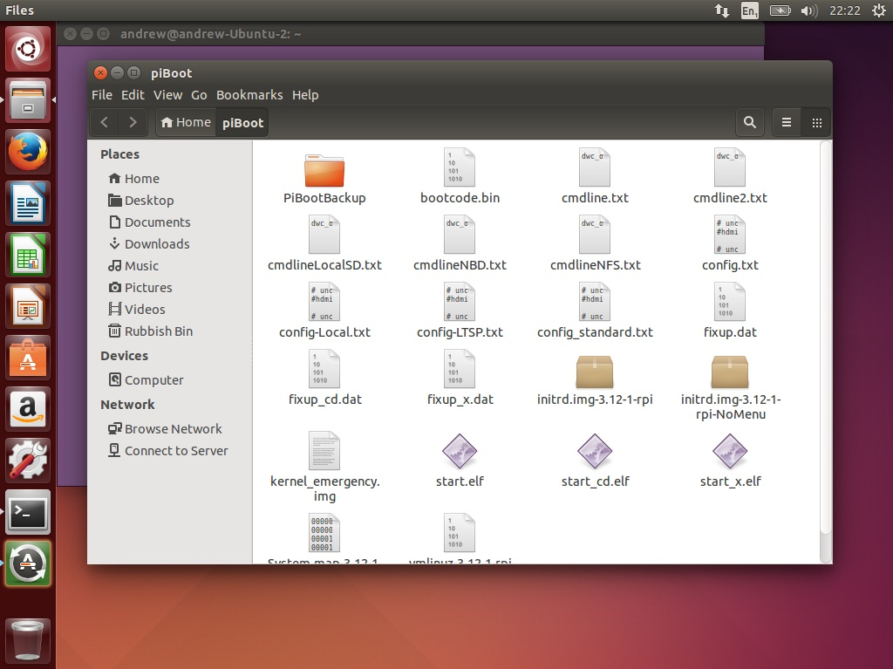

[Home](../README.md)    | [Getting started](../installation/getting-started.md)     | [Managing users](../manage-users/README.md) | [Collecting work](../collect-work.md) | Shared folders | [Backups](../backups/README.md) | [Advanced options](../advanced/README.md) 
| :-----------: |:-------------:| :-----:| :-----:| :-----:| :-----:| :-----:| 


Understanding RaspberryPi LTSP network technologies
======

RaspberryPi LTSP has 2 main network technologies available to use.
Both technologies have their advantages and disadvantages. By default NBD is used.

NFS
----
NFS is an older standard that its competitor NBD. It has been proved reliable for years
and is still the default for underlying LTSP for Ubuntu and Debian.
Keep in mind though RaspberryPi LTSP's default is NBD.
   
###Advantages   
- Old and reliable.
- Well supported on everything.
- All changes made to Raspbian from the server are live! No need to recompress the operating system.
- Very useful for testing and trying out different changes

###Disadvantages
- No compression enabled by default with LTSP so slower.
- Lacking some newer error detection etc.


NBD
----
NBD is a much newer file sharing technology that is the default for RaspberryPi-LTSP.   
With NBD, we have enabled squashfs compression to reduce network traffic by roughly 40%!   

###Advantages
- Raspberry Pis boos faster and load large applications faster.
- Consierably less network traffic transfered across the network due to compression (roughly 40% less).

###Disadvantages
- Changes are not live. You must recompress the operating system after each change with takes 5-10 minuets.
- After a recompress of the operating system, all clients need rebooted. 

Which should I use then?
----
Basically if you are testing out a number of changes (and don't want to wait 10 minuets for each test), then switch to NFS.   
Although NFS is slower generally on the Raspberry Pis, it is a lot quicker to experiment with.   
For a live production environment with an operating system image you are happy works, use NBD.   
NBD is much quicker and lighter on your network. This is especially important if you are using over 15 clients at one time.

I want to switch the network technology I am using, how do I do this?
------

1. First navigate to the ```other``` submenu in RaspberryPi LTSP and select ```Network-Technology```.   
   

2. Select the option you want to change to.   
   

3. Return to the main menu and run ```Update-SD``` and switching to a different network changes some configuration files on the SD card.   
(For those curious, only the cmdline.txt file is changed. It is swapped out with cmdlineNFS.txt or cmdlineNBD.txt).
   

4. Load the new generated boot files onto an SD card the load it up on a Raspberry Pi. For how to do this, see [SD-Card-Copy](../installation/sd-card-copy.html).   
   
   