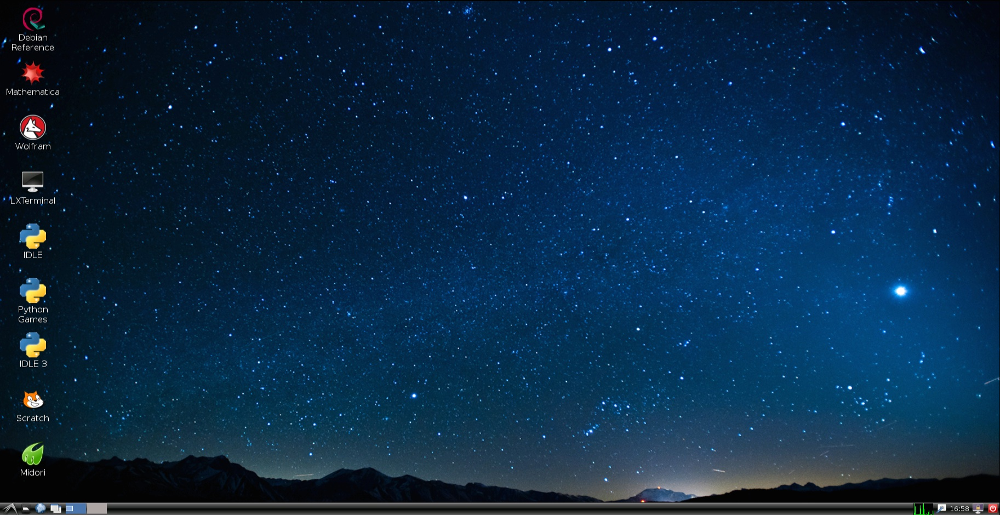

Frequently asked questions
----

I get a number of frequently asked questions about RaspberryPi-LTSP, here are the answers to a few.

- **How much does Raspi-LTSP software cost?**
Raspi-LTSP is completely free. The software is free and opensource. It is released under the GNU General Public Licence version 2 which you can view https://raw.githubusercontent.com/gbaman/RaspberryPi-LTSP/master/LICENSE

- **Can I run the server off a Raspberry Pi?**  
Although there is nothing stopping it in theory, doing this is unsupported and not recommended. The Raspberry Pi only has a 100mbit Ethernet port, 10 times slower than the modern standard available on most computers in the past few years of 1000mbit (or gigabit) Ethernet. This means boots will be slow for more than 1 or 2 Raspberry Pis.

- **Does it support wifi?**
No. Raspi-LTSP does not support wifi. Wifi is way too slow for this type of thing unless you use an expensive wifi high quality adapter. As most people buy cheap ones that aren't great (although claim to be!), boot speed would be drastically hit. Plus, keep in mind how wifi works. It has a shared bandwidth, for wireless N, the standard is roughly 150mbit/s. This 150mbit/s is shared between all devices on the network (unless using 2 networks via 2.4GHz and 5GHz, in this case you have 300mbit). A Raspberry Pi basically requires 50mbit/s to boot at a decent speed, so you could just about get 3 Raspberry Pis booting. But with wireless you have a number of other overheads and stuff like walls in the way and just general interference dropping the speed further.
To put this into perspective, standard gigabit Ethernet provides 1000mbit/s... 150mbit/s vs 1000mbit/s.
So although it is possible, the amount of work required to integrate common drivers etc into the initramfs and get it all tested massively outweighs the benefits, so no, Raspi-LTSP does not support wifi.

- **Is it much slower than running standard Raspbian off a normal SD card?**
Other than bootup, for most application no. Bootup takes roughly 30 seconds longer on most networks. For more detailed benchmarks, check out the benchmark section - https://github.com/gbaman/RaspberryPi-LTSP#benchmarks

- **Is the Raspberry Pi model B+ supported by Raspi-LTSP?**
Yes! As long as you are running at least version 0.7.2 and have updated the operating system and SD card image.
To do that, run "Update-all" to update all software on the virtual OS followed by "Change-IP" and update the files on your SD card with the new ones.   

- **Is the Raspberry Pi 2 (model B) supported by Raspi-LTSP?**   
Currently right now (5th February 2015) the answer to this is no. We are still waiting for the relevant kernel file updates to become available. When an update is released to support the Raspberry Pi 2, it will be automatically pushed to your Raspi-LTSP SD cards on boot.   

- **I was running Release 0.10.25 and can't update to newer versions?**   
There was a bug in version 0.10.25 which broke the auto updater. If you applied this update, please manually redownload Raspi-LTSP using ```wget --content-disposition http://pi-ltsp.net/downloadalpha``` followed by ```sudo bash Pi_ltsp```. This should manually apply the most recent update.   


