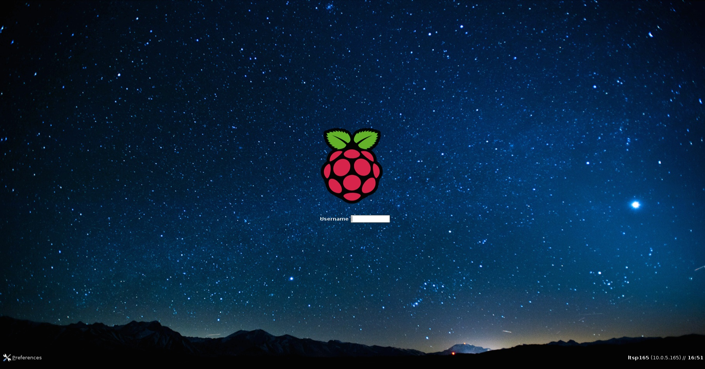

Getting started with RaspberryPi-LTSP
===============

#Ok, I am interested... How do I get started?
First you need to grab the required equipment.
- An old desktop/laptop computer for the server (preferably made within the last 6 years).
- A network switch (requires at least a single gigabit or 1000/100/10mbit port for the server).
- A router (for a standalone network) or connection to your schools network.
- Some Ethernet cables.
- A Raspberry Pi and SD card with a size of at least 128mb (so yes, 2gb, 4gb, 8gb etc cards will also work).

Installing
-----------

Once you have the needed equipment, you will need to install Ubuntu 14.04 onto your server computer and then install Raspi-LTSP.
Overall this takes roughly 2 hours. Of that 2 hours, you are required at the computer for 20-30 minutes maximum.
Finally when the installation is complete you must copy the generated SD card boot files to a blank SD card.

1. [Installing Ubuntu server](installing-ubuntu.md)
1. [Installing RaspberryPi-LTSP](installing-raspi-ltsp.md)
1. [Copying files to SD card](sd-card-copy.md)

Once completed, you may want to change some of the other options in Raspi-LTSP, the full documentation list can be found
