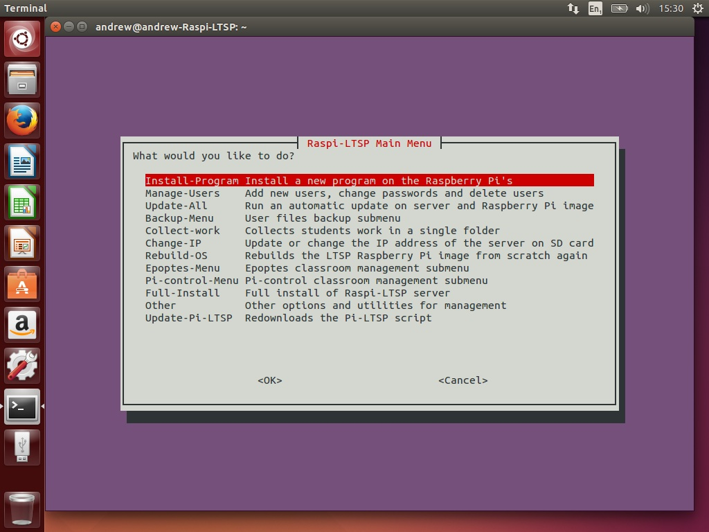
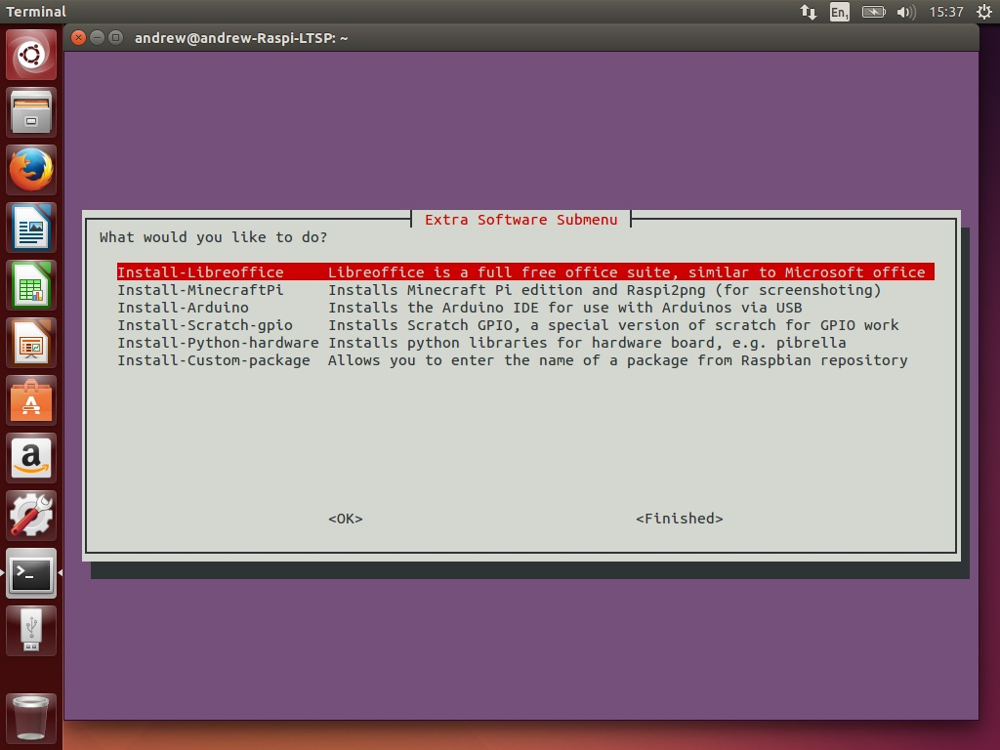
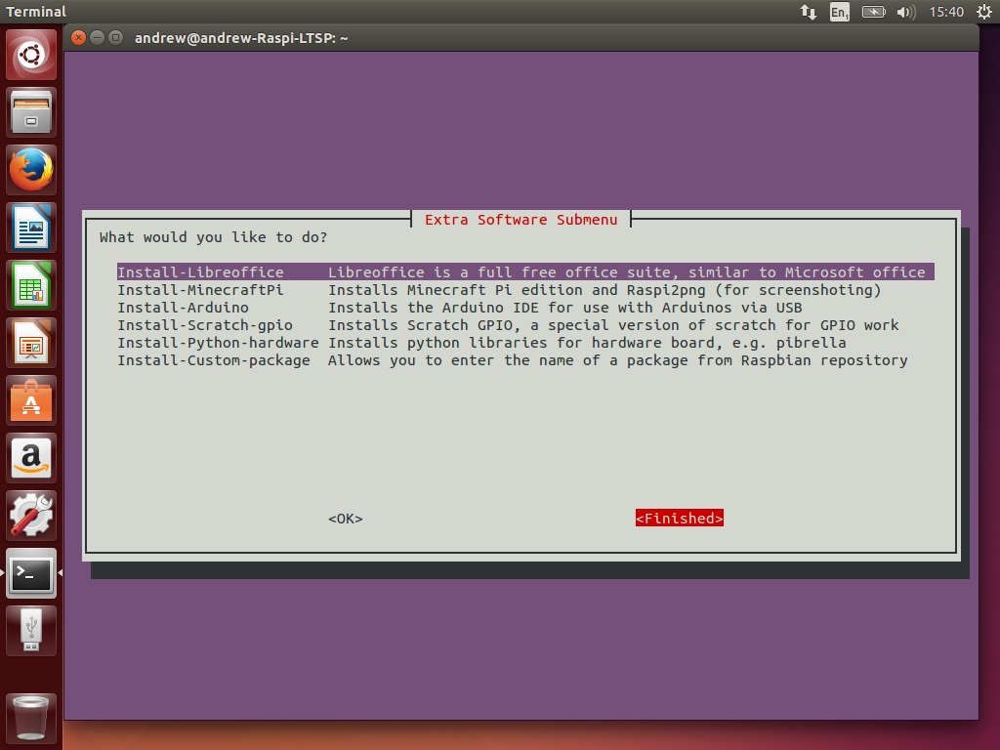
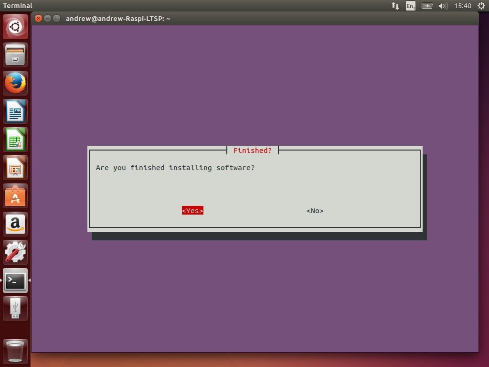

[Home](../README.md)    | [Getting started](../installation/getting-started.md)     | [Managing users](../manage-users/README.md) | [Collecting work](../collect-work.md) | [Shared folders](../shared-folders/README.md | [Backups](../backups/README.md) | [Advanced options](../advanced/README.md) 
| :-----------: |:-------------:| :-----:| :-----:| :-----:| :-----:| :-----:| 

Installing additional programs
------------------------------

Adding additional software is very simple. Be warned though, a number of
developers have taken a lazy approach to software with the Raspberry Pi
and hardcode the user to be Pi. This means this software may not work
with other usernames. If you come across any software with this issue,
try emailing the developer, as most are very happy to fix this issue.

Raspi-LTSP comes with a number of preconfigured options for installing
software or you can select “Install-Custom-package” and enter the name
of the software. This is exactly the same as doing “apt-get install
SoftwareName”.

1.  Select “Install-Program” and hit enter. 

2.  Select the package you wish to install. If it isn’t in the list
    select “Install-Custom-Package” and enter the name of the package.
    

3.  Once finished, select “Finished” 

4.  When asked if you are finished, select yes.
    

5.  If any changes were made, it will recompress the operating system to
    prepare it for the Raspberry Pis.
