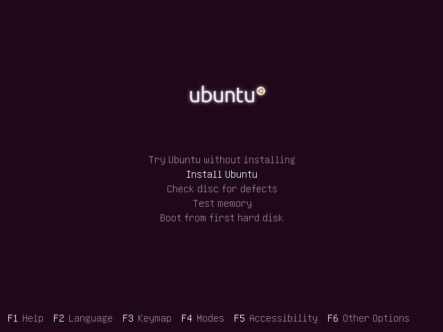
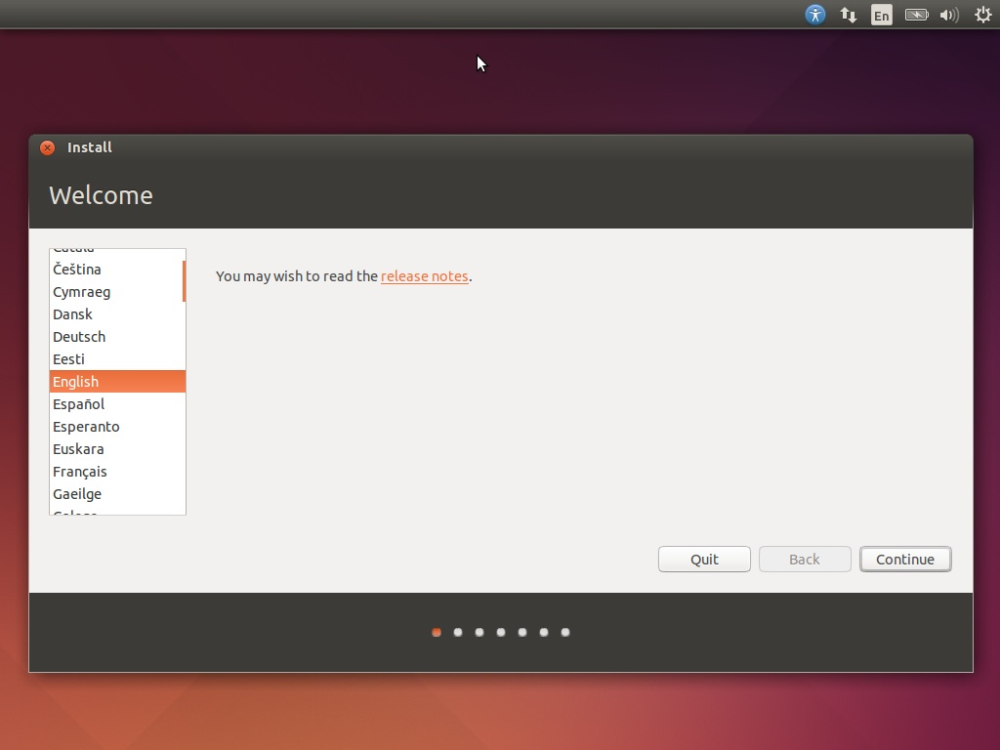
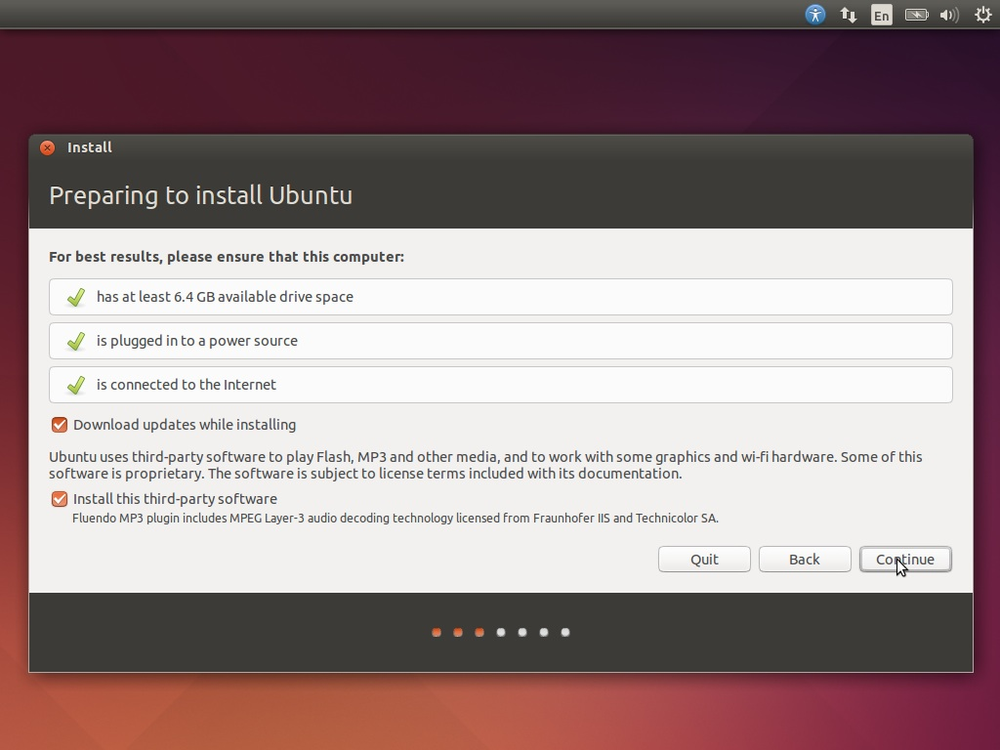
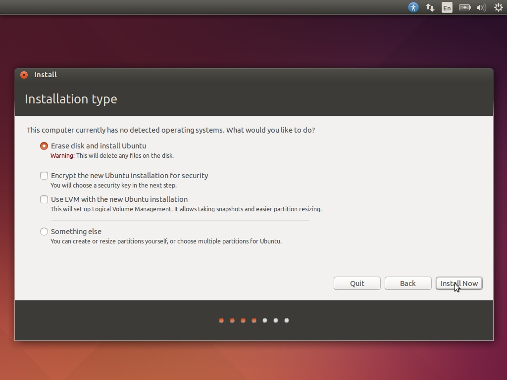
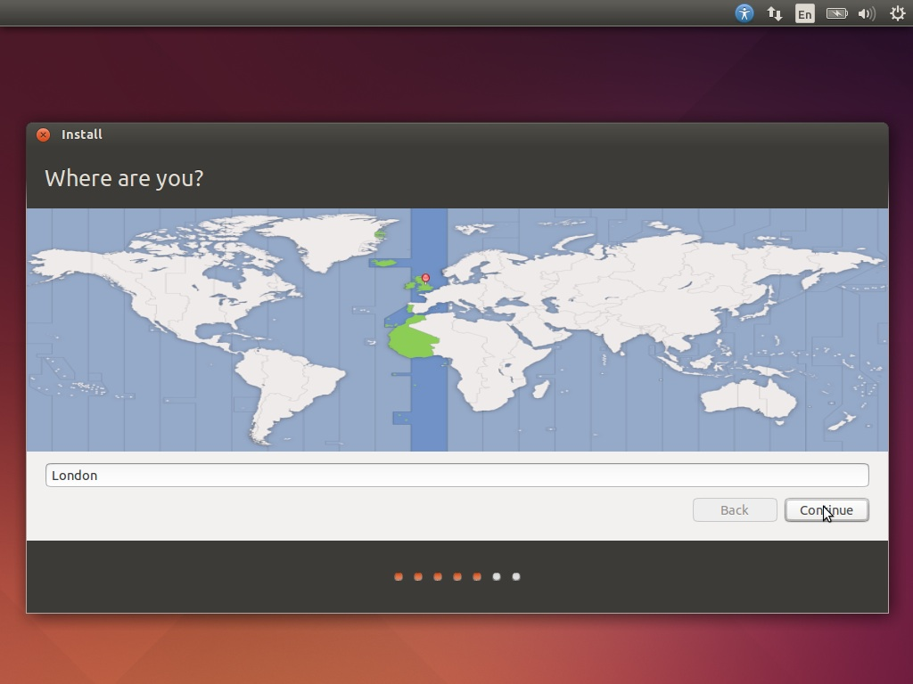
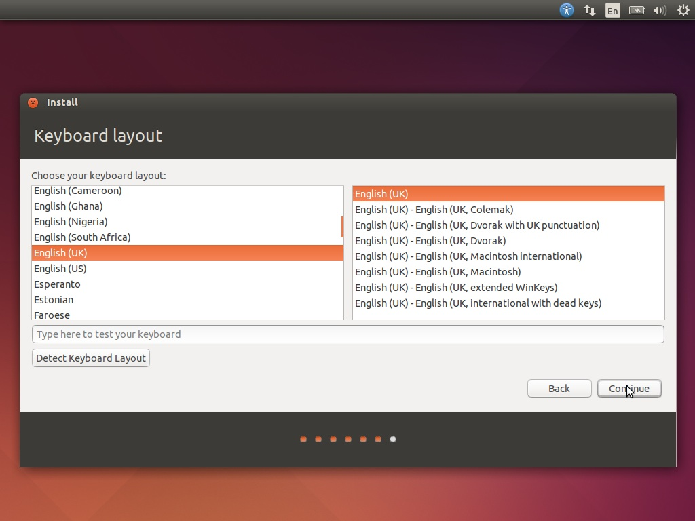
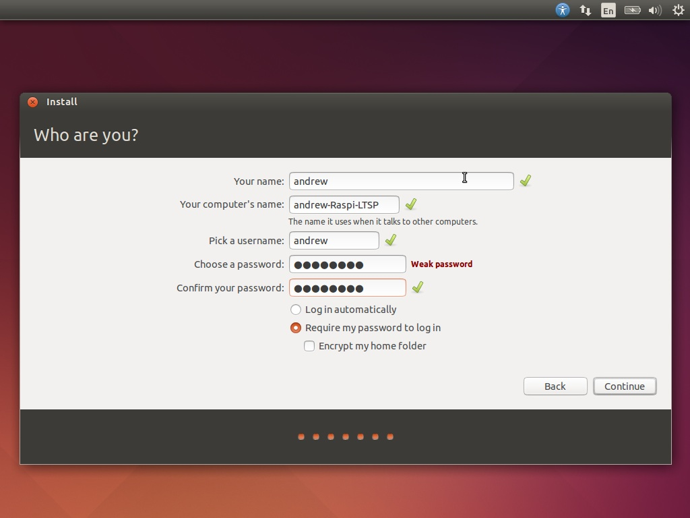
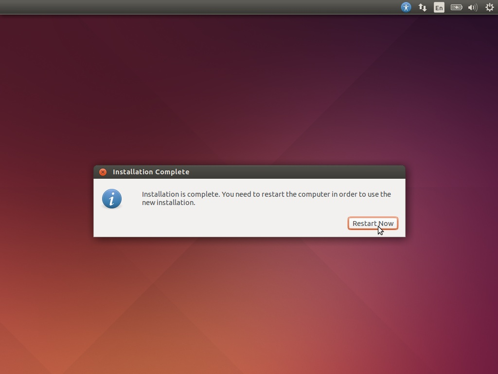

[Home](../README.md)    | [Getting started](../installation/getting-started.md)     | [Managing users](../manage-users/README.md) | [Collecting work](../collect-work.md) | [Shared folders](../shared-folders/README.md | [Backups](../backups/README.md) | [Advanced options](../advanced/README.md) 
| :-----------: |:-------------:| :-----:| :-----:| :-----:| :-----:| :-----:| 

Ubuntu
------

Linux itself is actually a family of different distributions, all their
own Operating Systems but based on the Linux Kernel. Ubuntu is one of
these distributions. It was specifically designed to be really simple
and easy to use for new users of Linux and is the single most popular
Linux distribution. The current LTS (Long Term Support) version of
Ubuntu is 14.04 (with the previous being 12.04). 14.04 has guaranteed
software and security updates till April 2019.

The codename for 14.04 is Trusty Tahr.

Installation
============

Creating Ubuntu Installation Disk
---------------------------------

### Windows

### Mac

### Ubuntu Linux

Installing Ubuntu 14.04
-----------------------

Please make sure your server machine has no important information left
on it, as we will be ***deleting everything***. You have been warned!
You also need a working (if possible unfiltered) Internet connection.
Wired Ethernet is preferable for installation.

1.  Insert your Ubuntu 14.04 installation disk into the computer you
    intend to use as a server

2.  Shutdown the computer

3.  Hold the “Boot from CD” key or “Boot menu” key. This is commonly F3.
    If in doubt, refer to your computer’s manual.

4.  Ubuntu installer screen should load up as below. Select “Install
    Ubuntu”

5.  Select English and hit continue

6.  Check both the “Download updates while installing” and
    “Install-third party software” and click
    continue.

7.  Select to “Erase disk and install Ubuntu”. This will completely wipe
    your hard drive! No information currently stored on this computer
    will remain. It will all be deleted 

8.  Select your location and time zone. For the UK, select London and
    hit continue 

9.  Select your keyboard. The default is likely correct. If living in
    the UK, select “English (UK)” and select
    continue.

10. Now enter your login details. These will be the administer login
    details on the server. It is recommended you leave the computer name
    at default.

11. Now wait for Ubuntu to install. This normally takes roughly 10-20
    minutes, depending on internet speed and computer processing power.
    

12. Once it finishes it will ask to reboot. Remove your installation CD
    from the drive and select “Restart now”.
    

##Installing RaspberryPi-LTSP

Now that Ubuntu is installed, you can move onto installing RaspberryPi-LTSP.   
[Installing RaspberryPi-LTSP](installing-raspi-ltsp.md)
