Installing Raspi-LTSP
---------------------
Now you have an Ubuntu 14.04 server setup, it is time to actually install Raspi-LTSP. Raspi-LTSP is run through a terminal.
This allows you use it locally or even run the software over SSH!
Lets get started!

1.  Once the machine reboots, login with your credentials you set up
    earlier. 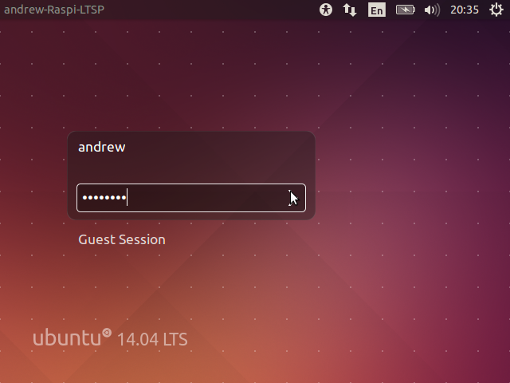

2.  Select the search button in the top left corner.
    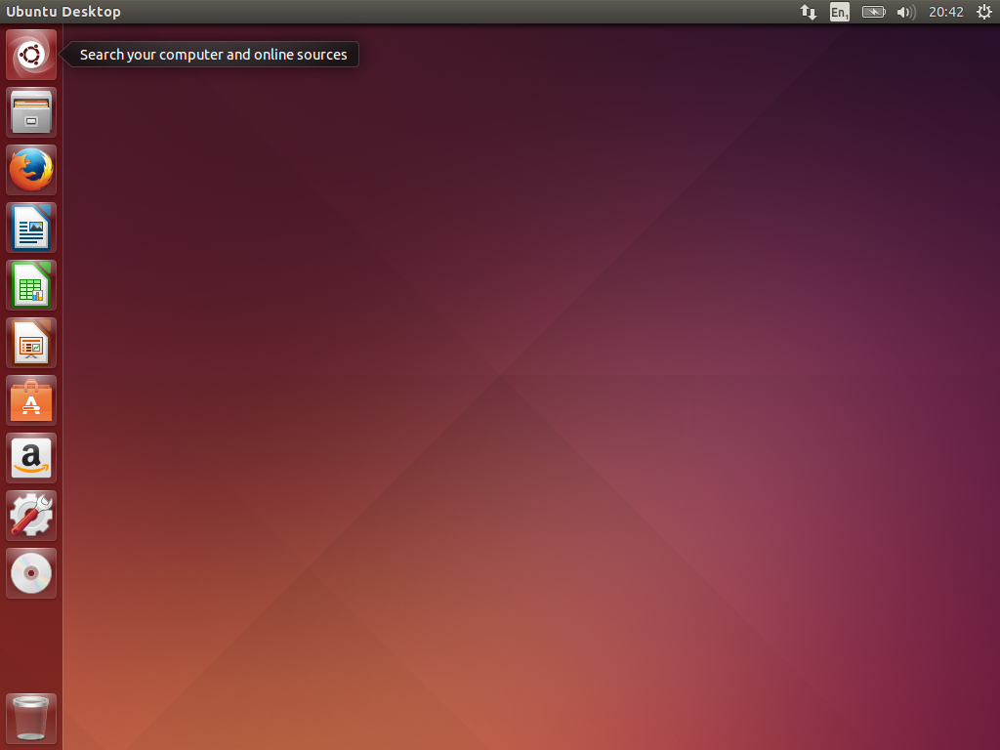

3.  Search for and select “Terminal”. You can also just hit Ctrl + Alt +
    T. 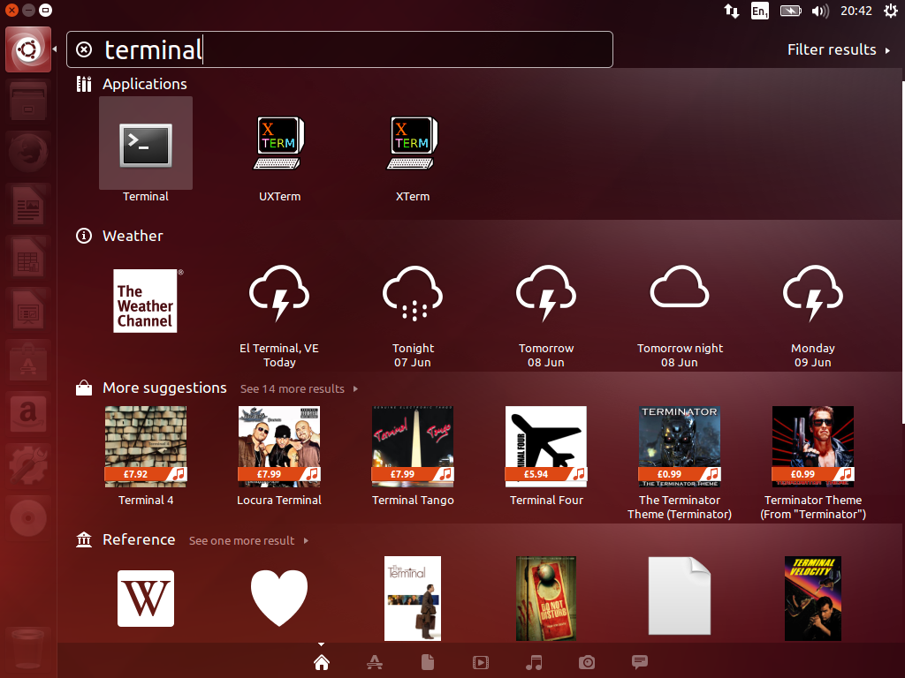

4.  You will then be presented with a terminal. Raspi-LTSP runs inside a
    terminal window. You may find it useful to resize the terminal
    window to make it larger or put it in full screen.
    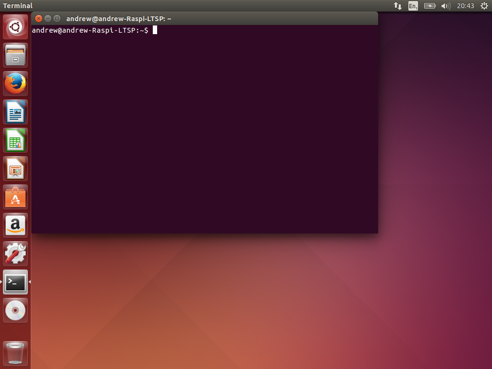

5.  Enter “wget
    http://raw.github.com/gbaman/RaspberryPi-LTSP/master/Pi\_ltsp”
    (Without quites) and hit enter. 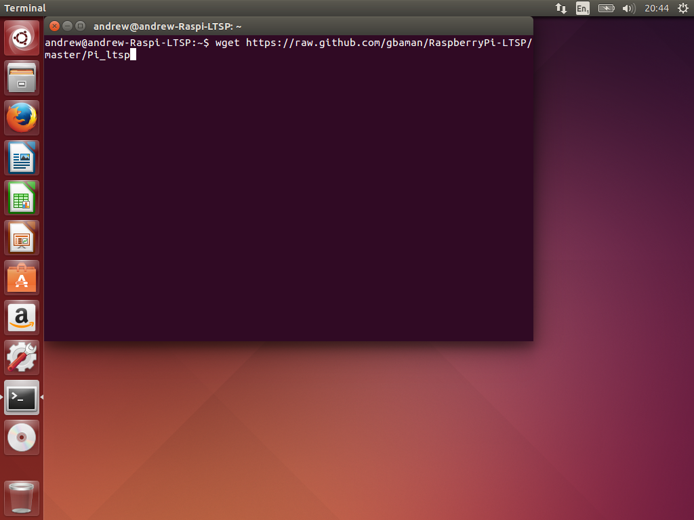

6.  Once that completes, enter “sudo bash Pi\_ltsp” which will launch
    Raspi-LTSP. You must repeat this command every time you want to
    launch Raspi-LTSP. 

7.  Enter your password as the application must be run as administrator.
    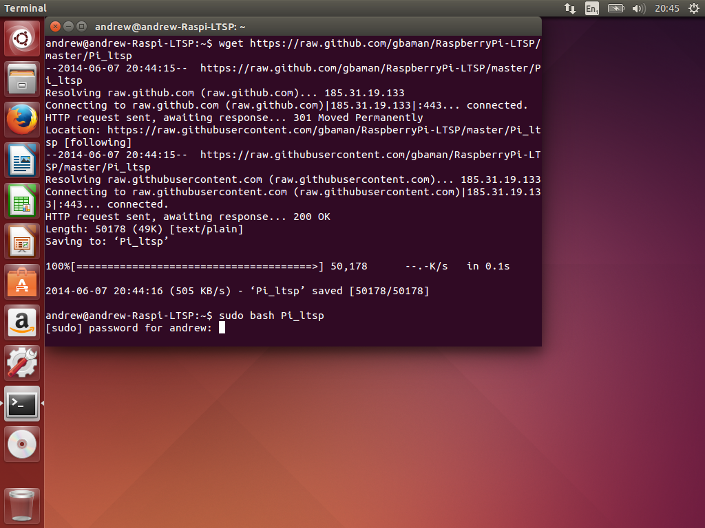

8.  Raspi-LTSP will prompt you if you would like to run a full install.
    Select yes. 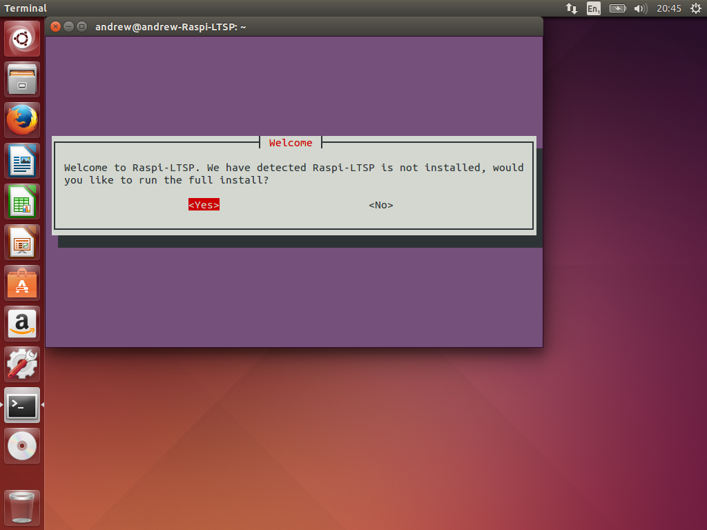

9.  The install will take roughly 1-2 hours depending on processor speed
    and internet speed. Select ok and it will start the installation.
    You can now leave it to work. 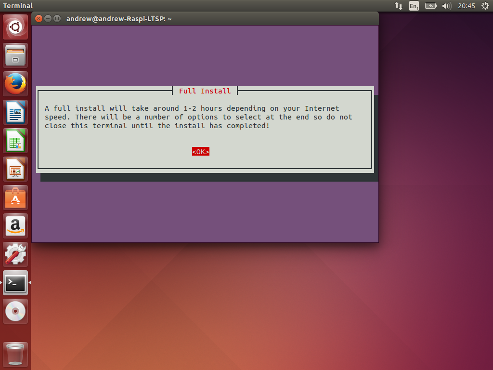

10. Around 1-2 hours later, the extra software dialog will be displayed.
    Here you can select any additional software you with to install.
    Libreoffice can be useful for a classroom; it is a free full office
    suit, similar to Microsoft Office. You can also install a custom
    package from the software repositories if you know its full name.
    Once you have finished, select cancel (or finished) to move on.
    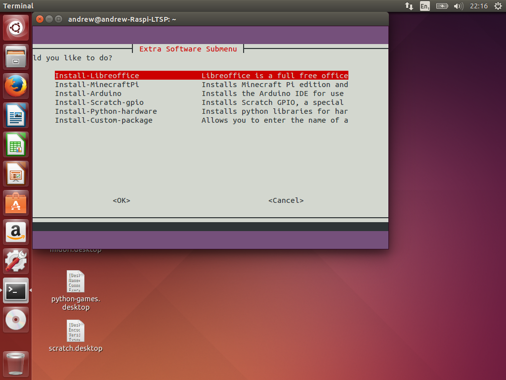

11. Select yes when asked if you are finished installing software.
    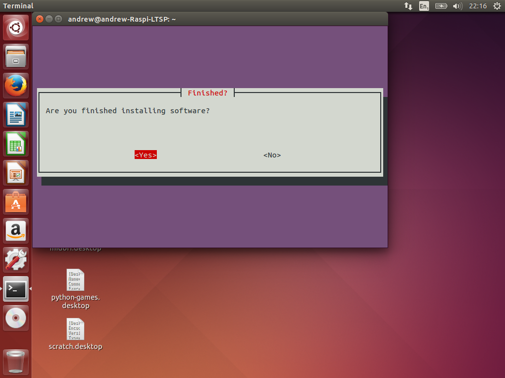

12. The operating system will now be compressed. After every change made
    to the operating system, it must be recompressed which takes roughly
    5 minutes normally. Select ok. 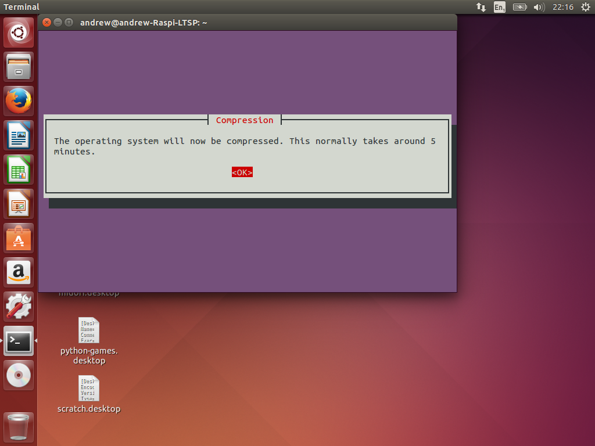

13. If using 2 network interface cards then check the IP address is
    correct. If you are only using 1 (most people), then the default
    will likely be correct. Select yes. 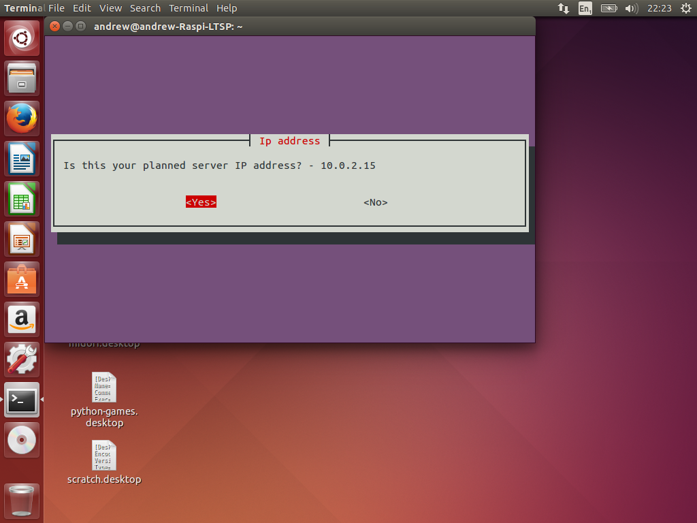

14. Finally, you must decide if you need students to have Sudo access on
    the Raspberry Pi. If you intend to work with the GPIO pins on the
    Raspberry Pi they will need it. You can really easily later enable
    or disable Sudo use in the Manage-Users submenu in the main software
    options. If in doubt, is recommended to just select yes.
    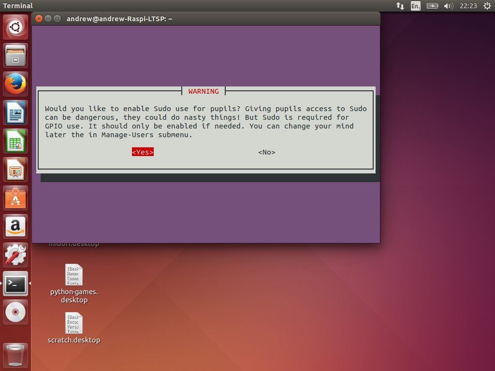

15. Raspi-LTSP installation is now complete. The server has generated an
    SD card image which is located in /home/YourUser/piboot\
    You need to copy these files onto a blank formatted SD card and
    connect the Raspberry Pi to the network.
    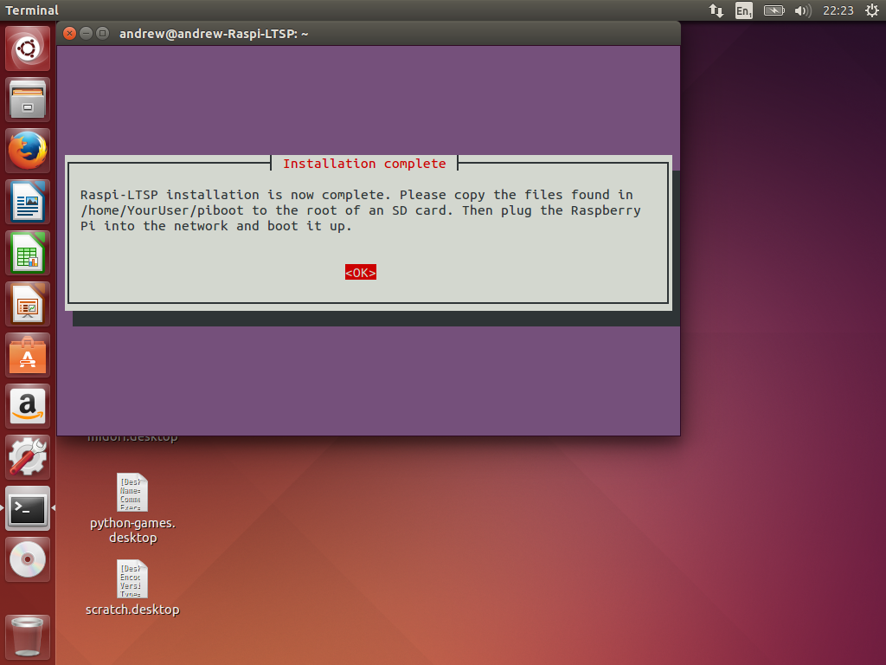

16. You are recommended to check the Backup section of this manual on
    setting up an automatic backup of your students work to an external
    hard drive in case of hard drive failure.

##Copying to SD card
Now that you have installed RaspberryPi-LTSP, you need to copy the boot files to an SD card.   
[Copy boot files to SD card](sd-card-copy.md)
