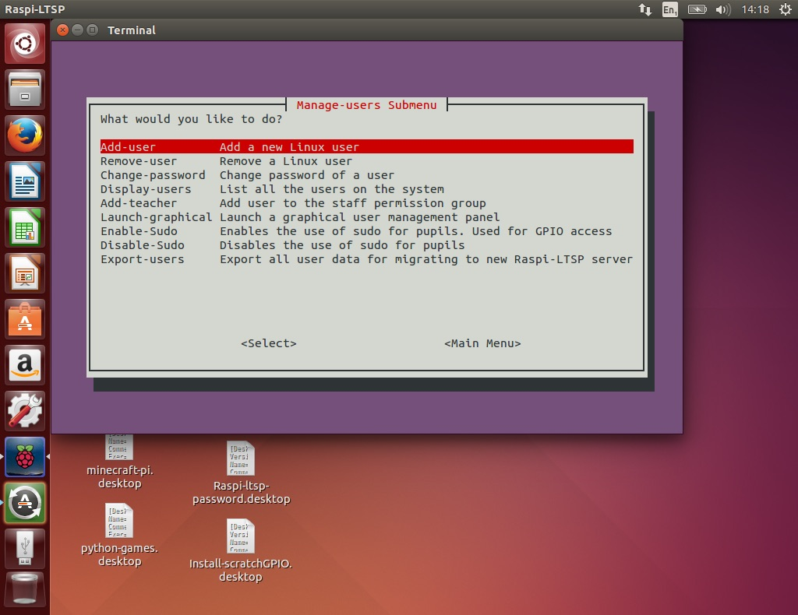

Managing user accounts
----------------------

The Manage user users submenu contains all the tools for working with the users and groups on the system.
Although there are graphical tools available that perform similar functions, it is much quicker using the built
in tools.

Tools
----

- [Creating a new user](creating-users.md)
- [Deleting a user](deleting-users.md)  
- [Changing a users password](change-password.md)  
- [Userstanding staff and sudo options](staff-sudo.md)  
- [Migrating user data (for moving to a new Raspi-LTSP server)](migration.md)