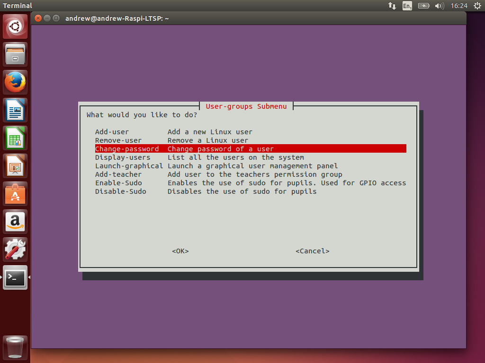
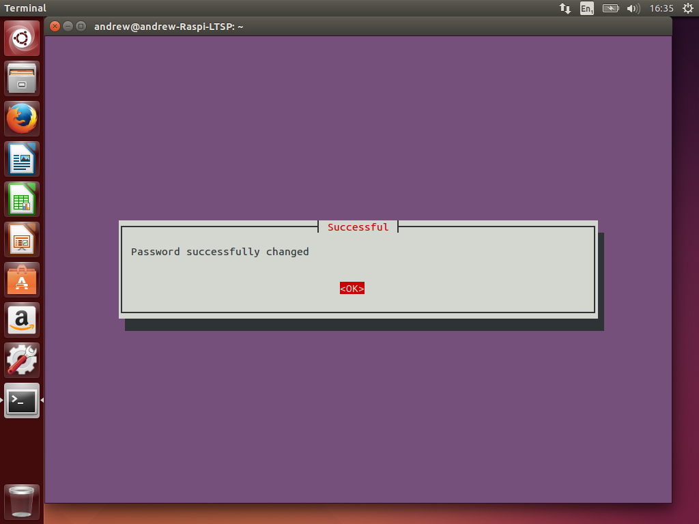
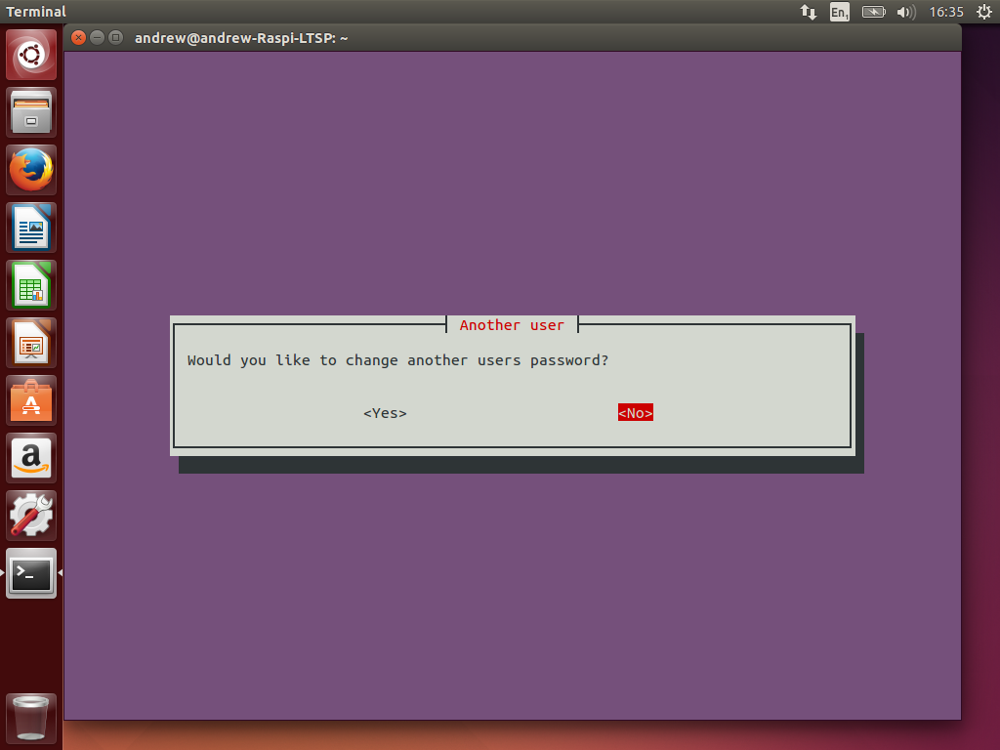

Change a users password
----

1.  From the main menu, select Manage-Users.
    

2.  Select Change-password. 

3.  Note the user you wish to change the password of from the displayed
    list and hit enter. 

4.  Enter the username you wish to change the password of.
    

5.  Enter the new password you wish to use with the user. For example,
    password and select ok. 

6.  You will then be informed the password change has been successful.
    Select ok. 

7.  If you wish to change more users passwords, select yes, if not
    select no. 
