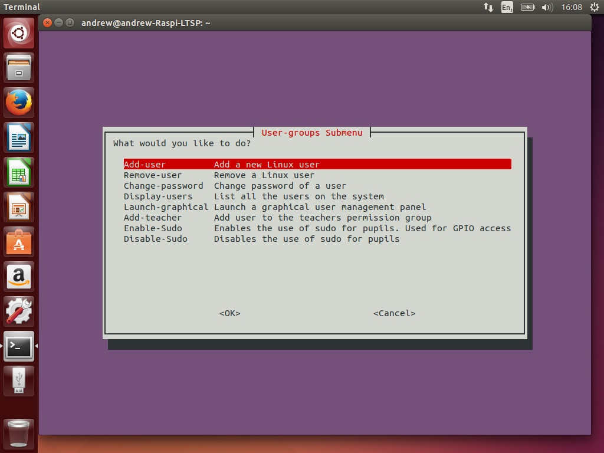
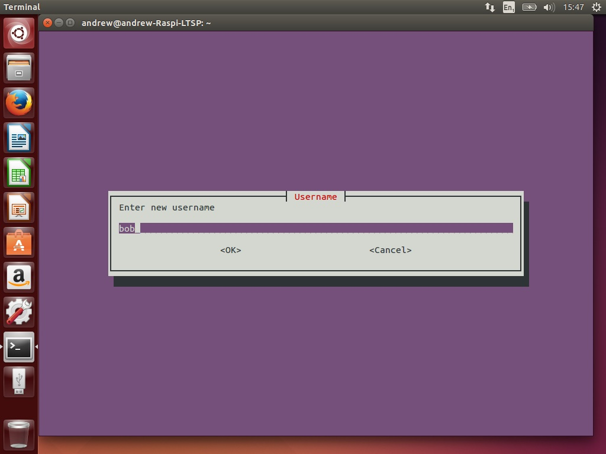

[Home](../README.md)    | [Getting started](../installation/getting-started.md)     | [Managing users](../manage-users/README.md) | [Collecting work](../collect-work.md) | [Shared folders](../shared-folders/README.md | [Backups](../backups/README.md) | [Advanced options](../advanced/README.md) 
| :-----------: |:-------------:| :-----:| :-----:| :-----:| :-----:| :-----:| 

Adding new users
----

1.  From the main menu, select Manage-Users.
    

2.  Then select add user. 

3.  Next enter the username for the new user. For example, Bob.
    

4.  Then enter the new users password. Please note this is displayed in
    plain text (as opposed to \*\*\*\*\*) but encrypted when saved.
    

5.  You will then be prompted if you want to add another user. If you
    are finished, select no. 
