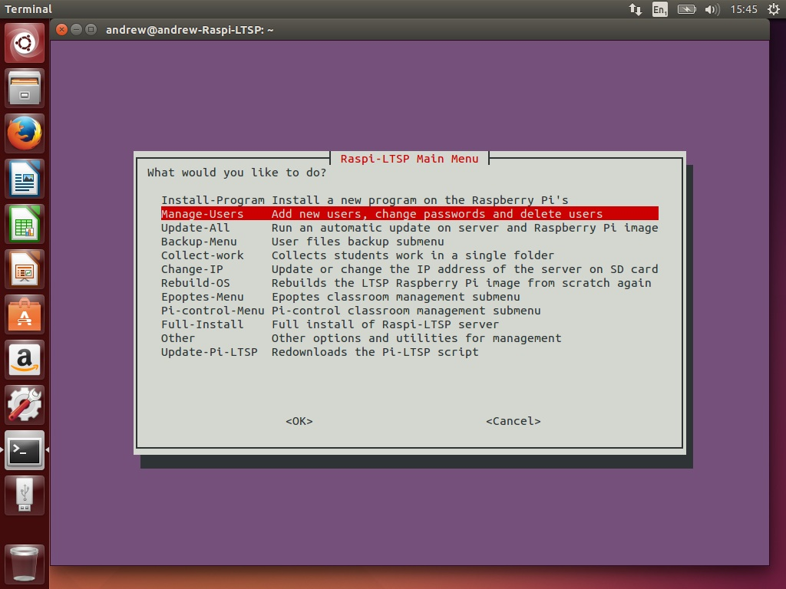

Removing Users
------

1.  From the main menu, select Manage-Users.
    

2.  Select Remove-user from the menu. 

3.  Note the full username of the user you want to delete from the list
    displayed and hit enter. 

4.  Enter the username of the user you want to remove. In my case, bob.
    

5.  Confirm the correct user is displayed and select ok.
    

6.  You will then be informed the user has been removed along with all
    their files. 
