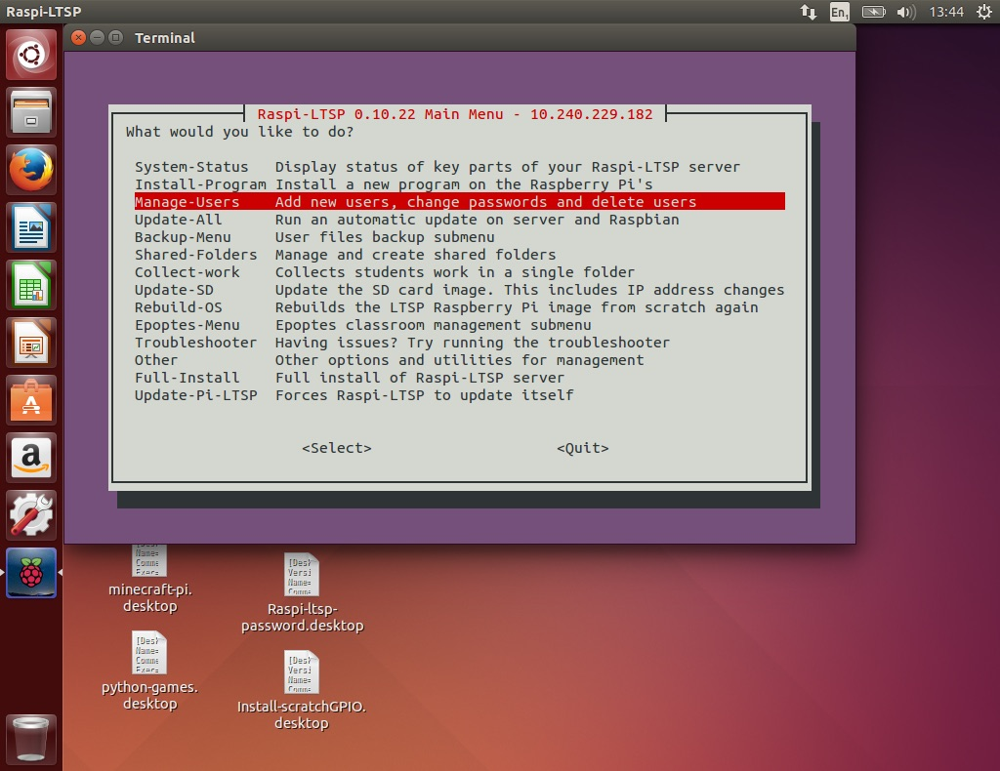
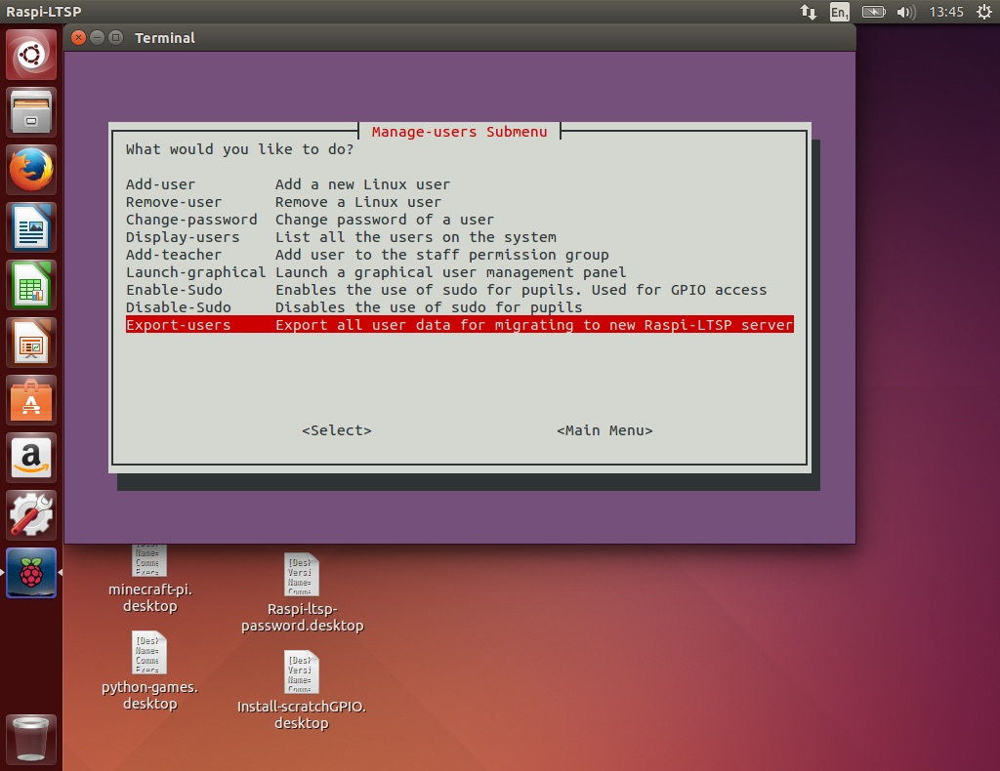
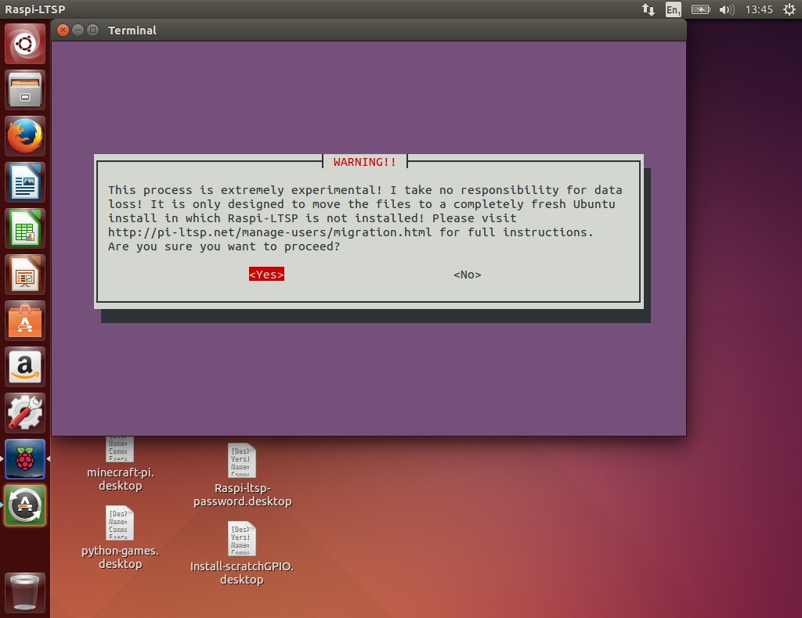
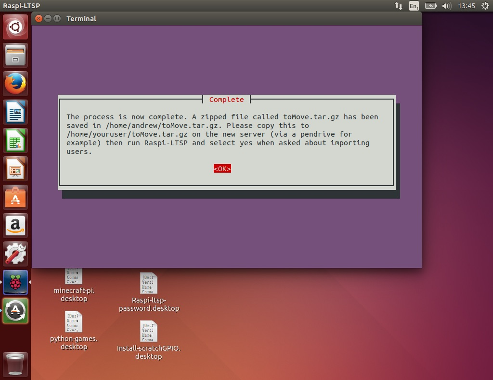
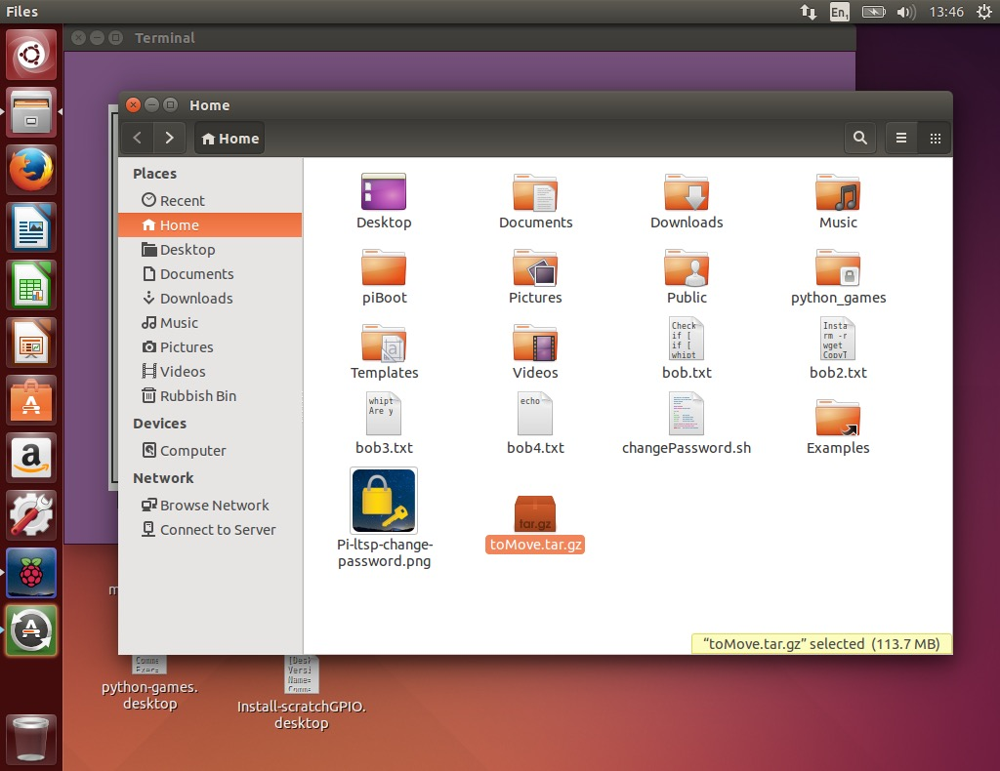
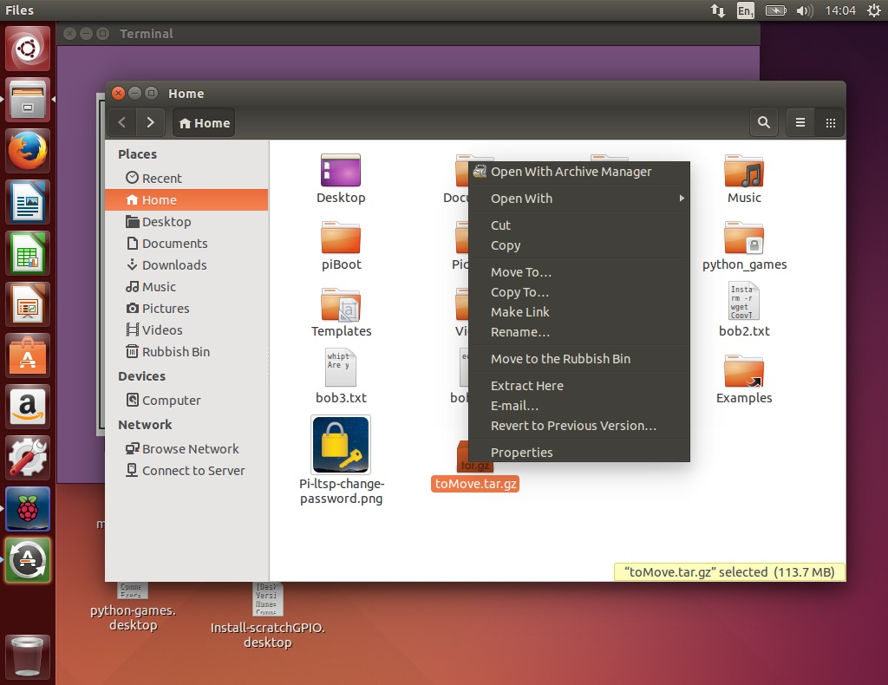
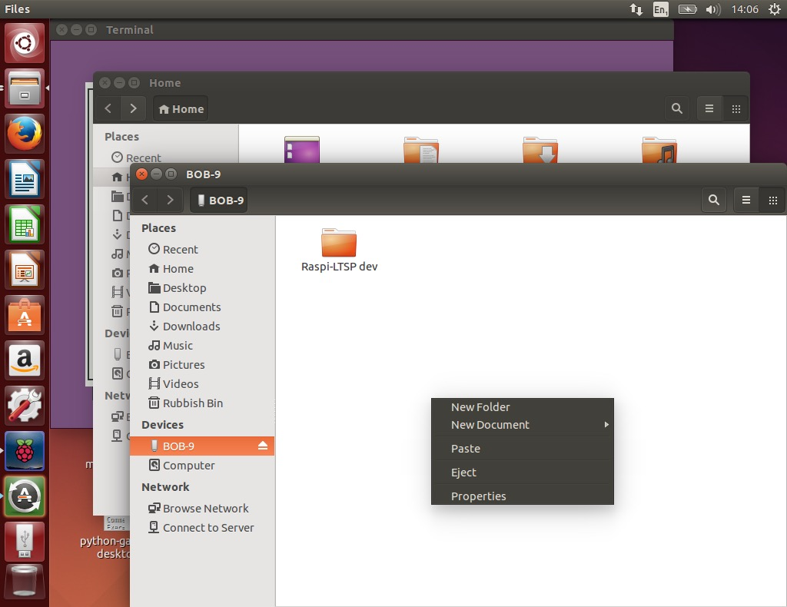

[Home](../README.md)    | [Getting started](../installation/getting-started.md)     | [Managing users](../manage-users/README.md) | [Collecting work](../collect-work.md) | [Shared folders](../shared-folders/README.md) | [Backups](../backups/README.md) | [Advanced options](../advanced/README.md) 
| :-----------: |:-------------:| :-----:| :-----:| :-----:| :-----:| :-----:| 


User data migration
----
RaspberryPi-LTSP includes a migration utility for migrating user data out of your server for transferring to another RaspberryPi-LTSP server.    
This can be especially useful if you want to reinstall your server or move it to a new piece of hardware but don't want to manually recreate all your users and copy their data across manually.   
   
Please note, **this process is still experimental! It may have unexpected side effects.**

1. Open Raspi-LTSP and select ```manage-users```.   
   
2. Then select ```Export users```.
   
3. Select ```Yes``` to proceed after reading the warning dialog box.
   
4. RaspberryPi-LTSP will then go away and zip up all the users home folders, the users file, the passwords (encrypted) file and the groups file into a single zip file called toMove.tar.gz which is stored in your home folder ready to be transfered. Select OK.
   
5. Open up the file manager and find the ```toMove.tar.gz``` file.   
 
6. Right click the file and select ```Copy```.   
   
7. Insert your pen/flash drive into the server. It should pop up. Right click and select ```Paste```. Once the file is copied, eject the pendrive.   
   
8. Follow the [Ubuntu 14.04 install guide](../installation/installing-ubuntu.md) as normal on the new server.   
9. Insert your pen/flash drive into the new server and copy and paste the toMove.tar.gz file into your home folder.   
10. When you start Raspi-LTSP for the first time, it will ask if you want to import user data, select ```yes```. When it asks to reboot, select ```yes```.   
11. Continue on as normal with the [installing RaspberryPi-LTSP guide](../installation/installing-raspi-ltsp.md) as usual.   
   
And don't forget, **if you are having issues with this process, feel free to drop me a message** via the contact details found on the [Support page](../support.md).