Copying boot files to SD card on Ubuntu
---------------------------------------
When Raspi-LTSP installs, it generates a folder of SD card files ready to be dropped onto an empty SD card for your Raspberry Pi.
Although this can be done on your Windows or Mac machine, it is even easier to plug in your SD card to the Raspi-LTSP server.
If your server does not have an SD card slot, you may want to try a USB SD card reader.
There is also nothing stopping you copying the files onto a USB stick to another computer to use its SD card reader.

Assuming you are connecting the SD card to the server (via USB or internal SD card adapter), follow the guide below.
(#some-markdown-heading)

-------
1.  Insert SD card into SD card reader on Ubuntu server. If the computer
    has an internal SD card reader, use it. If not, a USB reader is
    recommended.

2.  Open “Files” near top left. 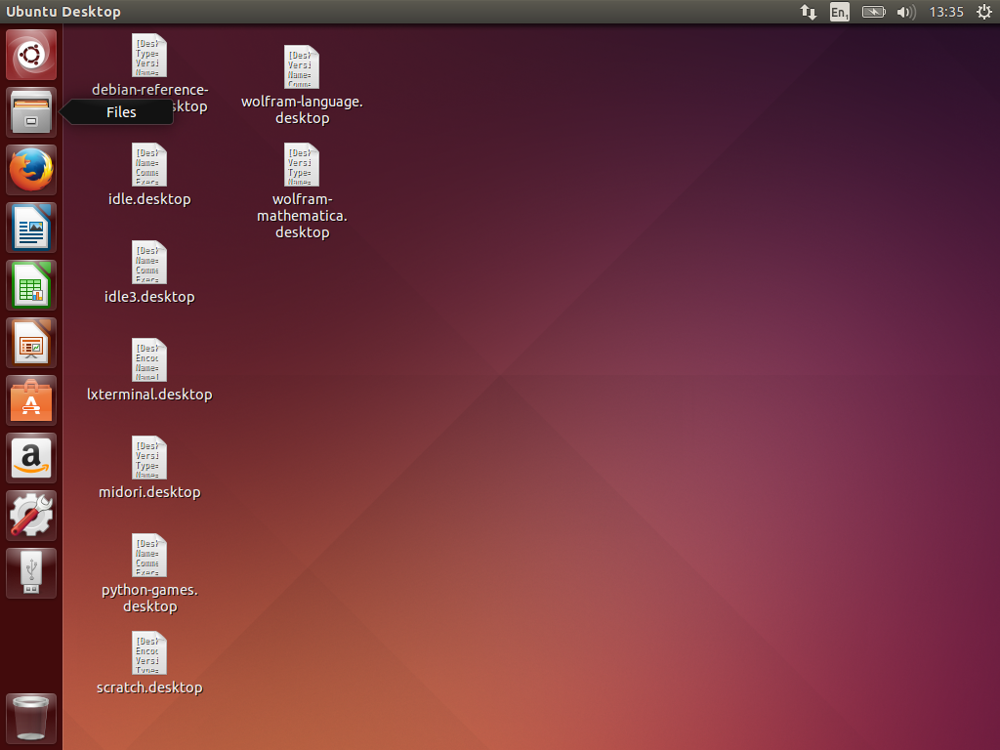

3.  Piboot folder with the required boot files is stored in this
    folder.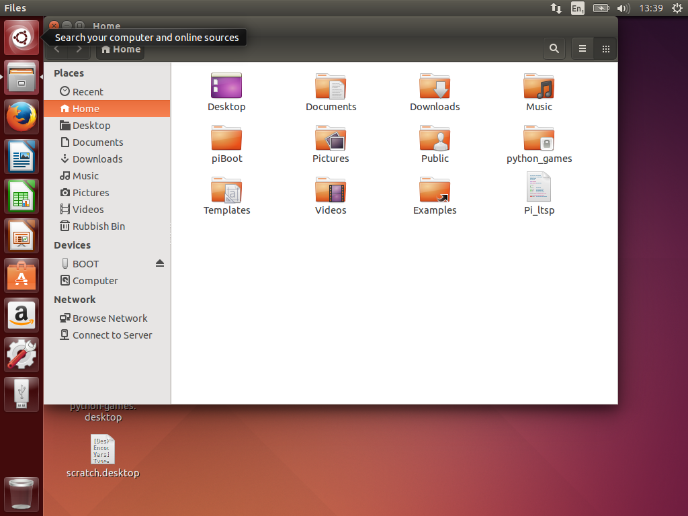

4.  Open search again and search for “Disks”, Ubuntu’s disk manager.
    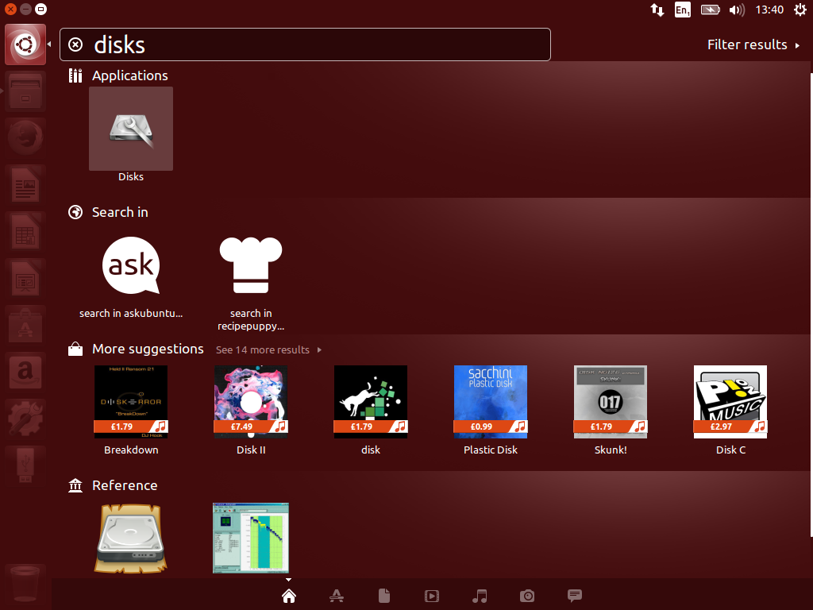

5.  Select your SD card from the menu at the side. Be very careful to
    pick the correct device here! A good check is check the size, for
    example my SD card in the screenshot is an 8 gigabit SD card.
    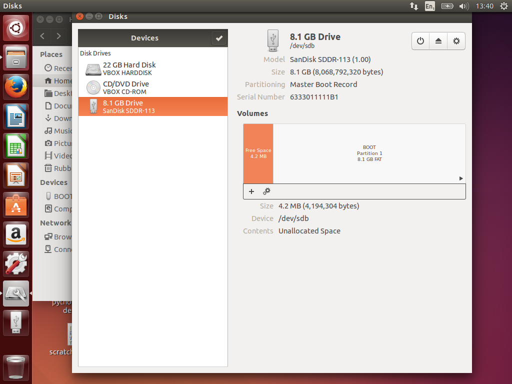

6.  Select the cog in the top right and select format.
    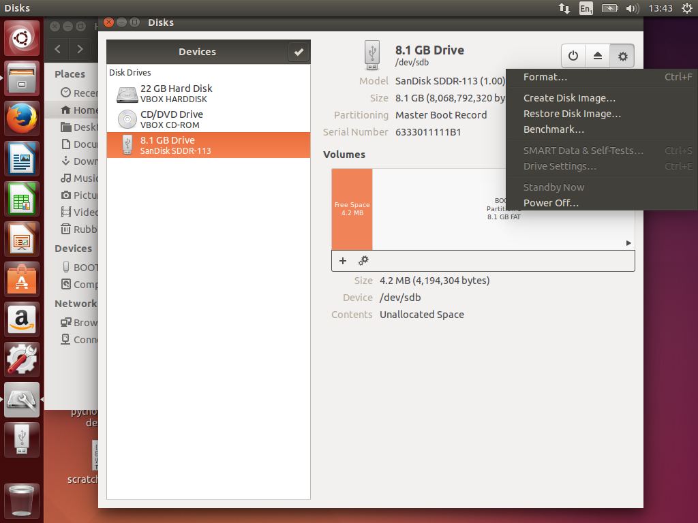

7.  The default options should be correct in the format settings window.
    Select “Format…”. 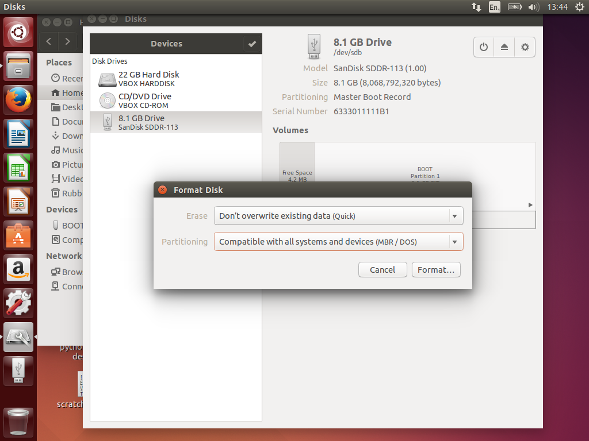

8.  Check the device is correct and select format.
    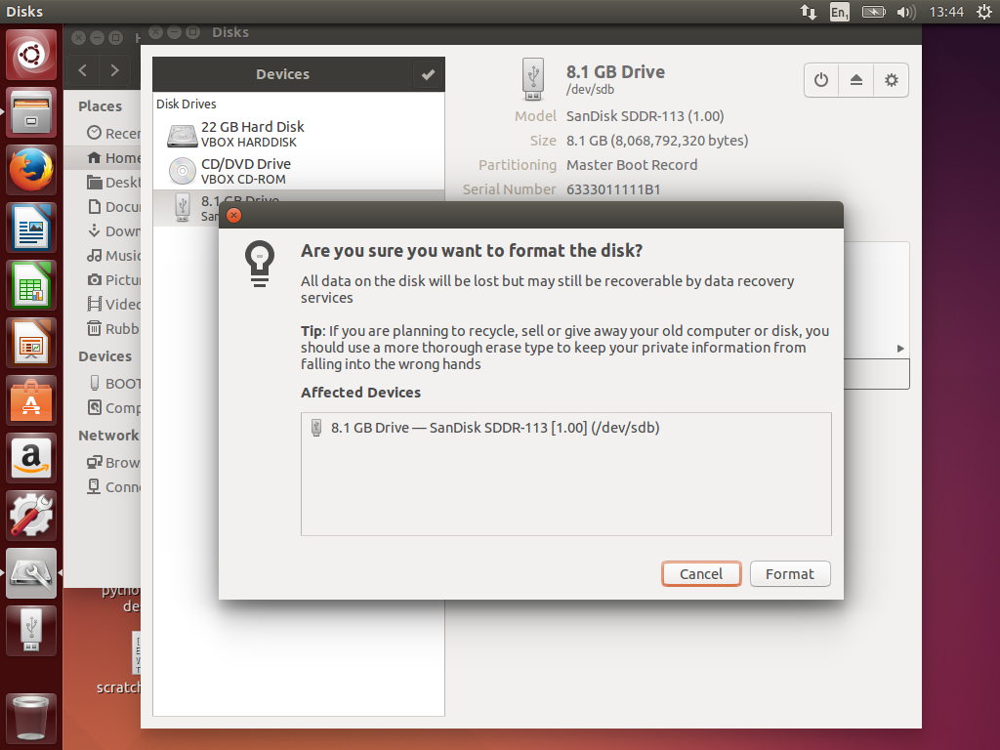

9.  Open the piBoot folder and select all the files by dragging while
    holding left mouse button down. 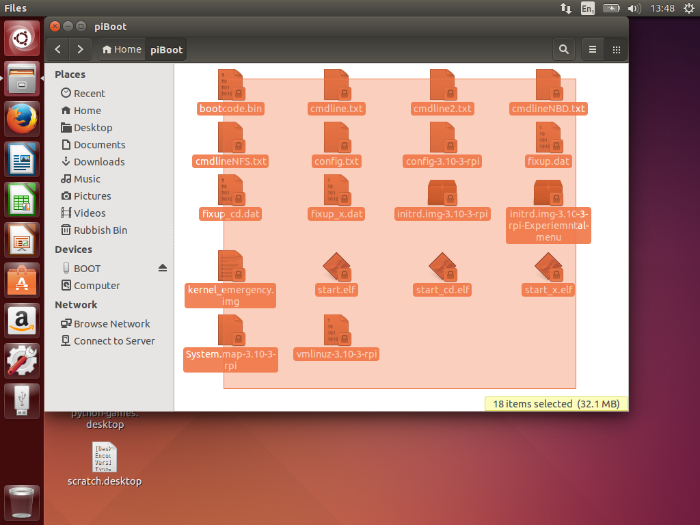

10. Right click any file in the selection and select “Copy to”.
    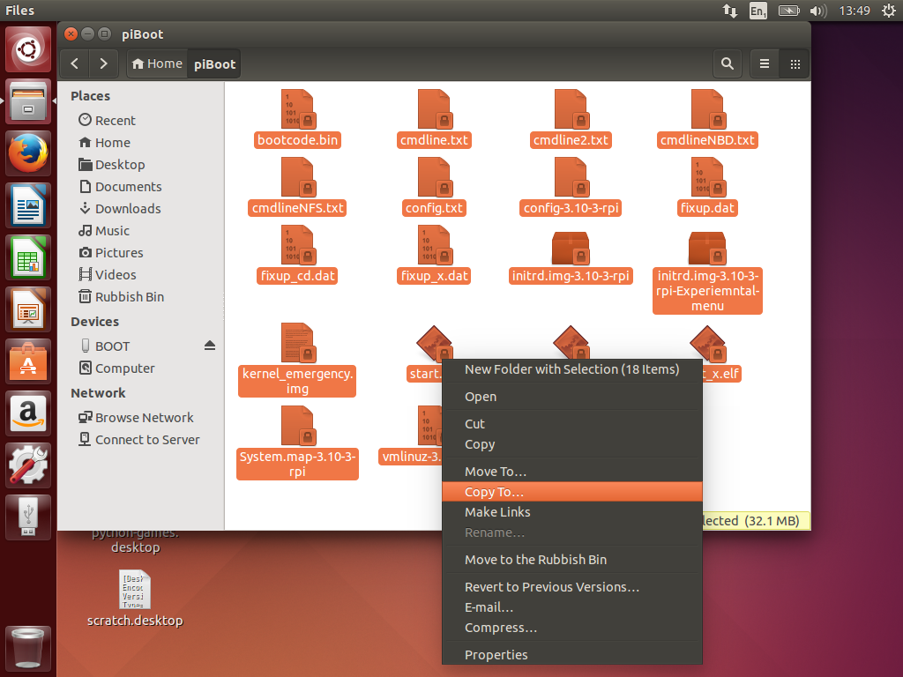

11. Select the SD card from the side bar. It is usually called BOOT but
    may be named anything. It should be completely empty. Then hit
    select. 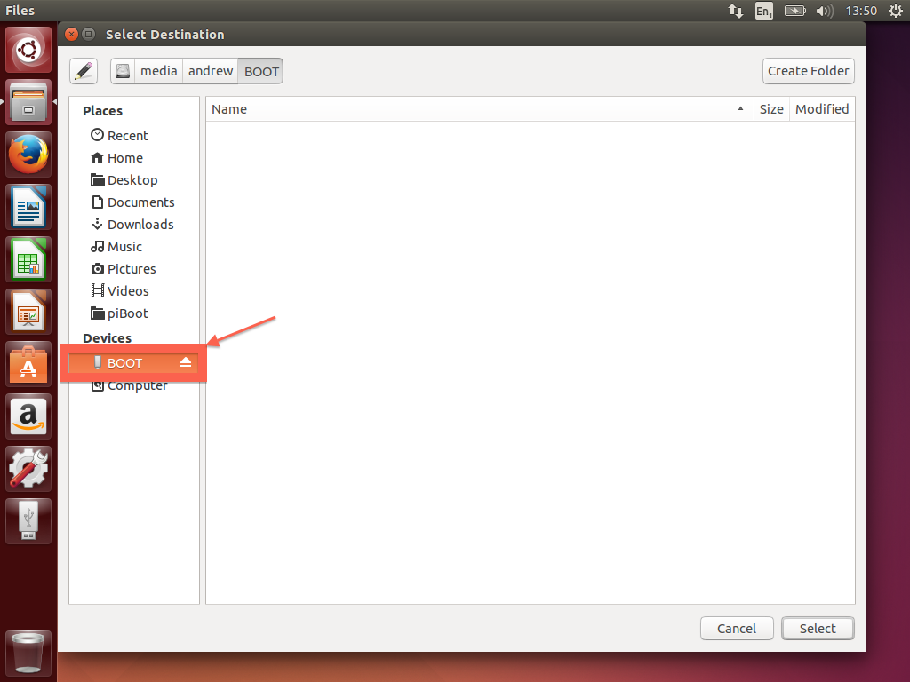

12. Finally hit the eject icon beside the SD card and remove it from the
    computer. Now insert it into a Raspberry Pi, plug the network cable
    in along with keyboard and mouse and plug in the power. The
    Raspberry Pi should then boot successfully.
    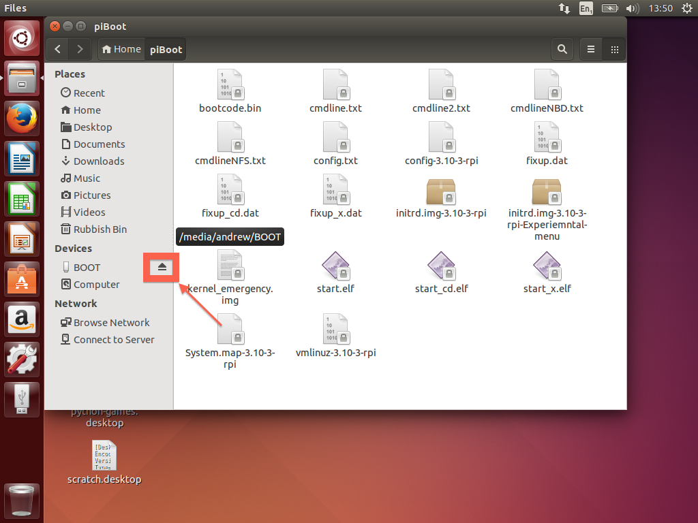

If the Raspberry Pi fails to boot, you may want to check the troubleshooting section
